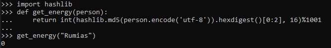
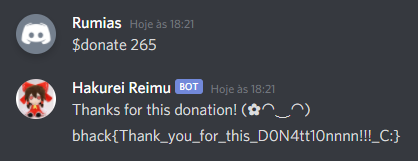

# Attention all Touhou Gamers

Foi dado um [script](reimu.py) de um Bot para o Discord e o disponibilizaram no Discord da competição como o user `@Hakurei Reimu
#0444`.

A flag seria mandada para o usuário ao passar o seguite check:
```py
#Donate to Hakurei Shrine!
@bot.command(pass_context = True)
async def donate(ctx):
	if True in [youkai in ctx.author.name for youkai in youkai_list()]:
		if get_energy(ctx.author.name) > 1:
			await ctx.send("Hey! You're definitely a Youkai! Go to fuck out!")
			return
		if checkCard(ctx.message.content.split()[1].split("#")[0]):
			await ctx.send("Thanks for this donation! (✿◠‿◠)")
            # Aqui a flag é enviada
			await ctx.send(io.open("flag.txt", mode="r", encoding="utf-8").read()) 
		else:
			await ctx.send("Dear human, your credit card is invalid :(")
	else:
		await ctx.send("Hey! Who are you? You arent Gensokyo villager!")

```

Começando do if mais externo, é exigido que o nome do usuário contenha pelo menos um das strings contidas na lista a seguir.
```py
["Rumia", "Hong Meiling", "Yukari Yakumo", "Yuuka Kazami","Rinnosuke Morichika", "Ichirin Kumoi", "Saigyou Ayakashi","Tokiko", "Orange", "Bakebake", "Evil Eye Sigma", "Hoshizako", "Kedama"]
```
No segundo if exige que tenha uma energia menor ou igual a 1, ou seja, 0 ou 1. Precisaria de um nome que tenha um dos nomes acima e tenha o primeiro byte do MD5 como 00 ou 01. 
```py
def get_energy(person):
	return int(hashlib.md5(person.encode('utf-8')).hexdigest()[0:2], 16)%1001
```
Para consegui essa energia, fiz um script para colocar letras aleatórias na frente de dos nomes da lista e calculando a energia, e por minha surpresa o nome `Rumias` foi uma reposta curta e rápida de se encontrar.





E o cartão, que pedia para ser passado, só precisaria retornar com um múltiplo de 10 ao passar pela função. Testei alguns números até chegar em `265`.

Por fim, simplesmente alterei o nome da conta do Discord para `Rumias` e enviei o comando para `$donate 265` para o bot que respondeu com a flag.


