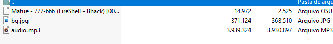
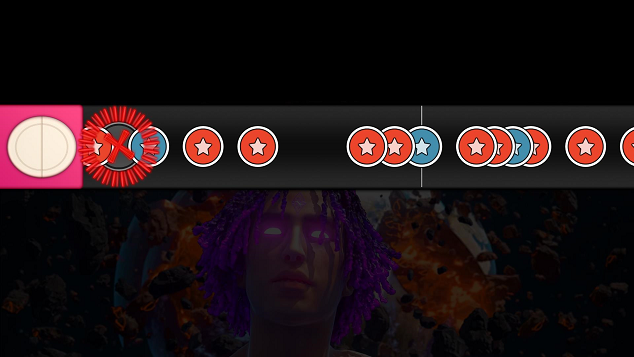

# Binary Taiko

Foi disponibilizado um arquivo `.osz`, que por sorte sei que é um arquivo pro jogo OSU, mas com uma busca básica no google se descobre facilmente. 
Mas o arquivo não passa de nada mais que um zip. Dentro dele existe o arquivo .mp3 da música, uma imagem de background e um arquivo `.osu`.

Ao abrir no jogo, a musica só consiste de dois tipos de inputs (mouse equerdo e direito), o que me levou a pensar (junto com o nome do desafio) que seria uma mensagem codificada em binário nas batidas do jogo.

Para consegui extrair a sequencia de batidas do arquivo `.osu` foi utilizado a biblioteca em javascript [osu-parser](https://github.com/nojhamster/osu-parser). A biblioteca faz o parse de um arquivo `.osu` e com isso consigo acessar um array chamado de `hitObjects` que contém as batidas (hits) da musica. Nesses hits contém um array com soundTypes que, no caso da música, pode ser do tipo `normal` ou `clap`. Com isso, criei uma string binária onde `clap` é codificado como 1 e `normal` como 0.
```js
var parser = require('osu-parser');

function binaryAgent(str) {

    var newBin = str.split(" ");
    var binCode = [];
    
    for (i = 0; i < newBin.length; i++) {
        binCode.push(String.fromCharCode(parseInt(newBin[i], 2)));
    }
    return binCode.join("");
}

parser.parseFile('Matue - 777-666 (FireShell - Bhack) [000-111].osu', function (err, beatmap) {
    const binary = beatmap.hitObjects.map((hit, index) => (hit.soundTypes[0] == 'normal' ? "0" : "1" ) + ((index + 1) % 8 == 0 ? ' ': '')).join('')
    const flag = binaryAgent(binary);
    console.log(flag);
});
```
Que ao executar resulta no seguinte:
```console
Very Nice!!! The flag is: bhack{All_you_consume_is_a_v1rus!}
```